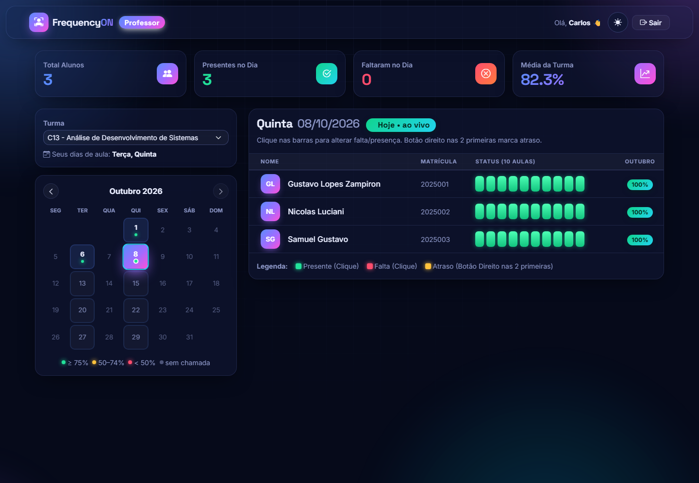
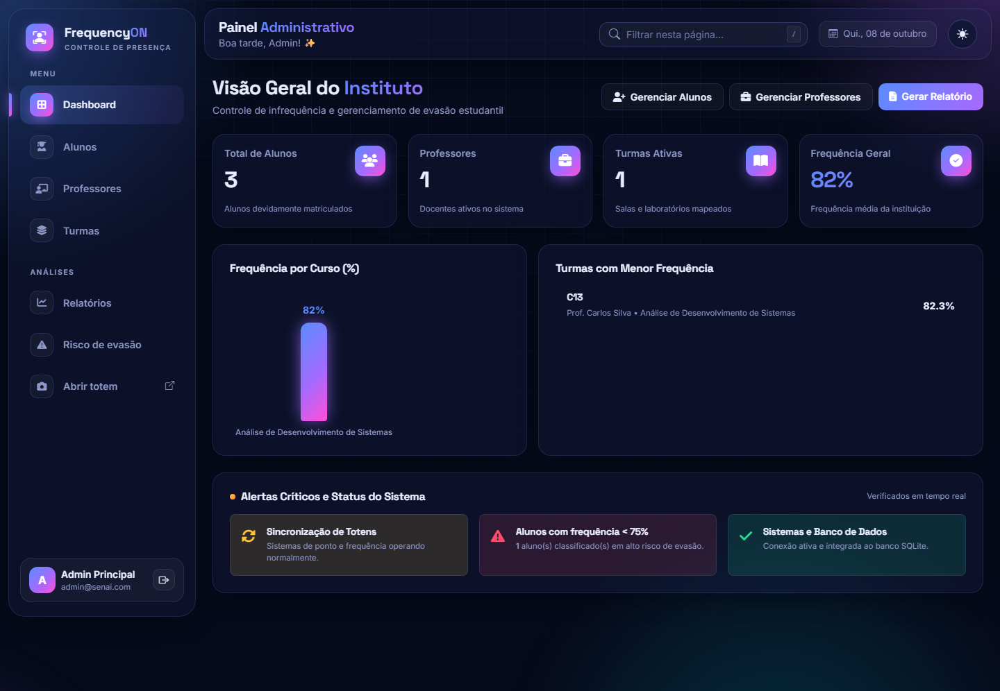
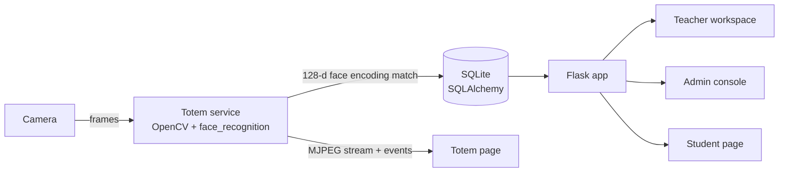

<div align="center">

# FrequencyON

**Attendance that takes itself.**
Face-recognition check-in for schools, plus a live dashboard that flags students at risk of dropping out before it's too late.


</div>

---

## Why FrequencyON

Taking attendance by hand eats into teaching time every single class, and paper roll calls rarely turn into data anyone looks at. By the time a school notices that a student has stopped showing up, that student is often already gone.

FrequencyON fixes both ends of that problem:

1. **Capture**: students walk past a camera at the entrance (the *totem*) and are checked in automatically. No cards, no lists, no queues.
2. **Act**: every check-in feeds dashboards for teachers and administrators that surface low attendance per student, per class and per course, so the school can step in early.

## Who it's for

| User | What they get |
|---|---|
| **Students** | A personal page with their attendance rate, a lesson-by-lesson history, CSV export and online absence justification. |
| **Teachers** | One-click roll call for 10 lessons a day, a monthly calendar colour-coded by class attendance, and automatic check-ins from the totem. |
| **School administrators** | Institution-wide KPIs, reports by course and teacher, a dropout-risk list, and control over classes, teachers and timetables. |

## Product tour

### Totem check-in
- Live camera feed in the browser with on-screen feedback: confetti and a sound on success, distinct states for *late*, *outside the allowed time* and *no class today*.
- **Self-enrolment**: a student types their student ID in front of the totem and the system captures and stores their face encoding.
- Lessons that have already happened when the student arrives are marked absent; the current and upcoming lessons are marked present. The first lesson is *present* up to `07:05` and *late* up to `07:10` (both configurable).
- Check-ins only count on the class's scheduled weekdays, and each student is registered once per day.

### Teacher workspace


- Month calendar: class days are clickable and colour-coded by that day's attendance (≥ 75%, 50–74%, < 50%, no roll call yet).
- Ten attendance bars per student: click to toggle present/absent, right-click on the first two lessons to mark late.
- Today's roll call is editable. Past days are read-only unless an administrator's password is entered.
- Per-student monthly attendance at a glance.

### Admin console


- KPIs: students, teachers, classes and overall attendance.
- Reports: monthly attendance trend, attendance by course, top teachers by class attendance.
- **Dropout risk**: every student below 75% attendance in one list.
- Classes can have **several teachers**, and each teacher has **their own weekdays** in each class (e.g. Maths on Tue/Thu, English on Wed/Fri). A class's school days are the union of its teachers' days.
- Review absence justifications sent by students (accept / reject).

### Student page
- Attendance ring with *Regular / Attention / Critical* status.
- History of every school day with all 10 lessons, filterable by absences or late arrivals.
- **Export to CSV** (Excel-friendly).
- **Justify an absence** online and follow its status.

### Interface
- One design system across the product, with dark and light themes (the choice is remembered per browser).
- Responsive from phone to desktop. Motion is disabled automatically for users who prefer reduced motion.

## How it works



1. The totem service reads frames from the camera on a background thread, finds faces with dlib's HOG detector and turns each face into a 128-dimension encoding.
2. The encoding is compared with every enrolled student. A match needs a distance ≤ **0.50** on **2 consecutive frames**. The same student isn't processed again for **8 seconds**.
3. A match writes one record per lesson (`present` / `late` / `absent`) for that student and day, then pushes an event that the totem page picks up (polled every second).
4. Teachers, students and administrators read the same records, so every screen shows the same numbers.

**Attendance rate** = lessons attended (present + late) ÷ (school days with a roll call in the class × 10 lessons).

## Tech stack

| Layer | Technology |
|---|---|
| Backend | Python 3.14, Flask 3.1, Flask-SQLAlchemy 3.1 |
| Database | SQLite (any SQLAlchemy URL via `DATABASE_URL`) |
| Computer vision | OpenCV, `face_recognition` (dlib, HOG model) |
| Frontend | Jinja templates, Bootstrap 5.3, vanilla JavaScript, Chart.js 4 |

## Getting started

### Requirements
- Python **3.14**
- A webcam, only needed for the totem. The rest of the app runs without one.
- On Windows, a prebuilt `dlib` wheel is included in the repository.

### Install

```bash
git clone https://github.com/ZAMPIRON/tcc-frequencyon.git
cd tcc-frequencyon

python -m venv .venv
# Windows:  .venv\Scripts\activate
# macOS/Linux:  source .venv/bin/activate

# Windows only: install the bundled dlib wheel first
pip install dlib-20.0.99-cp314-cp314-win_amd64.whl

pip install -r requirements.txt
```

### Run

```bash
python app.py
```

Open **http://localhost:5000**. The totem is at **http://localhost:5000/totem**.

On first start the database is created in `instance/frequencyon.db` along with a default administrator:

| Role | Login | Password |
|---|---|---|
| Admin | `admin@frequencyon.com` | `admin123` |

### Demo data (optional)

```bash
python seed.py
```

> ⚠️ `seed.py` **deletes all existing data** (students, classes, attendance, justifications) before creating one admin, one teacher, one class (Tue/Thu) and three students. Use it only on a demo database.

## Configuration

All settings are environment variables:

| Variable | Default | Purpose |
|---|---|---|
| `SECRET_KEY` | `troque-esta-chave` | Flask session key. **Must be changed in production.** |
| `DATABASE_URL` | `sqlite:///frequencyon.db` | Any SQLAlchemy database URL. |
| `TOTEM_CAMERA` | `0` | Camera index used by the totem. |
| `HORARIO_PRESENTE` | `07:05` | Check-ins up to this time are *present* for lesson 1. |
| `HORARIO_ATRASO` | `07:10` | Check-ins up to this time are *late* for lesson 1. |
| `HORARIOS_AULAS` | `07:00,07:50,…,14:30` | Start time of each of the 10 daily lessons (comma-separated). |
| `FREQUENCYON_DATA` | *(empty)* | Freezes "today" to a date (`YYYY-MM-DD`), for testing. |

The school time zone is `America/Sao_Paulo`.

## Project structure

```
.
├── app.py                  # Flask app: routes for admin, teacher, student and totem
├── database.py             # Models, attendance rules and timetable settings
├── face_service.py         # Camera + face recognition service used by the totem
├── seed.py                 # Demo data (wipes the database!)
├── requirements.txt
├── static/
│   ├── css/
│   │   ├── tema.css        # Design system: colours, components, animations (dark/light)
│   │   ├── inicio.css      # Landing page
│   │   ├── login.css       # Login screens
│   │   ├── admin.css       # Admin console
│   │   ├── professor.css   # Teacher workspace
│   │   ├── aluno.css       # Student page
│   │   └── totem.css       # Totem
│   ├── js/efeitos.js       # UI effects: toasts, confetti, theme switch, counters
│   └── uploads/            # Student and teacher photos
├── templates/
│   ├── componentes/        # Shared <head> and scripts
│   ├── base_login.html     # Base for the three login screens
│   ├── admin/  professor/  aluno/  totem/
│   └── index.html          # Landing page
└── docs/screenshots/
```

The codebase and UI are in **Brazilian Portuguese**: *aluno* = student, *professor* = teacher, *turma* = class, *presença* = attendance, *falta* = absence, *atraso* = late.

## Privacy & security

FrequencyON processes **biometric data of students, many of them minors**. Biometric data is sensitive under Brazil's LGPD and the EU's GDPR, so how it is handled matters as much as the features.

**How it works today:**
- Faces are stored as numeric encodings (128 floats per student) in the database. Recognition runs on the school's own machine, and no images are sent to third-party services.
- Profile photos are saved in `static/uploads/`, which the web server **serves publicly** to anyone who knows the file name.

**Before using it with real students, at minimum:**
- [ ] Set a strong `SECRET_KEY` and replace the default admin password.
- [ ] Serve the app over HTTPS.
- [ ] Move photos out of `static/` and serve them only to logged-in users.
- [ ] Collect consent from students and guardians, with a retention and deletion policy for face data.
- [ ] Add CSRF protection to forms.
- [ ] Add liveness detection: HOG + encoding matching alone can be fooled by a printed photo.

## Roadmap

- **Product:** English and Spanish UI, notifications to guardians when attendance drops, ready-made reports for education departments.
- **Platform:** multi-school (multi-tenant) accounts, PostgreSQL, deployment with Docker.
- **Vision:** anti-spoofing / liveness detection, several totems per school, offline-first totem that syncs later.
- **Integrations:** export to school management systems and learning platforms.

## Team

Built by **Gustavo Lopes Zampiron** as a capstone project (TCC).

## License

No license has been chosen yet, so all rights are reserved by the authors. Contact the team before using or redistributing this code.
